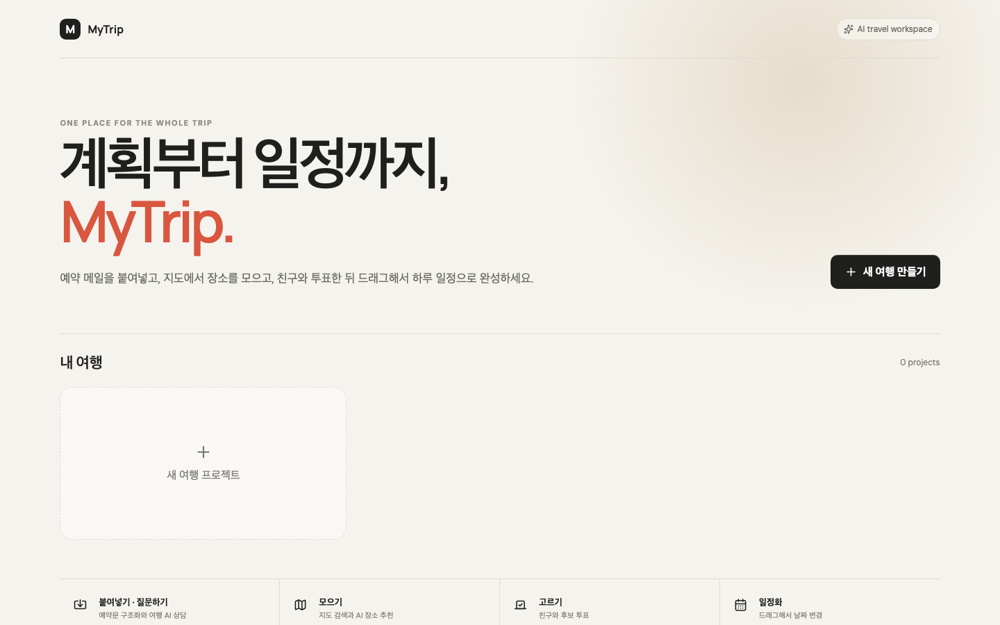
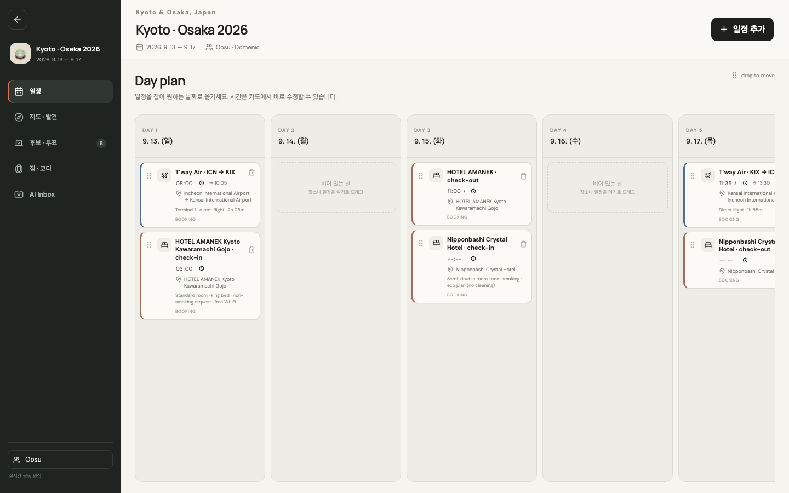
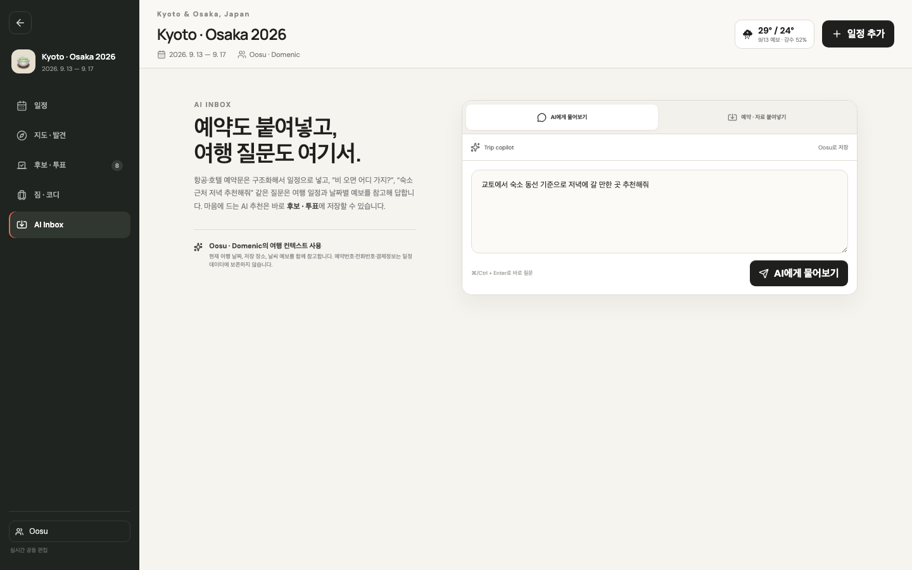
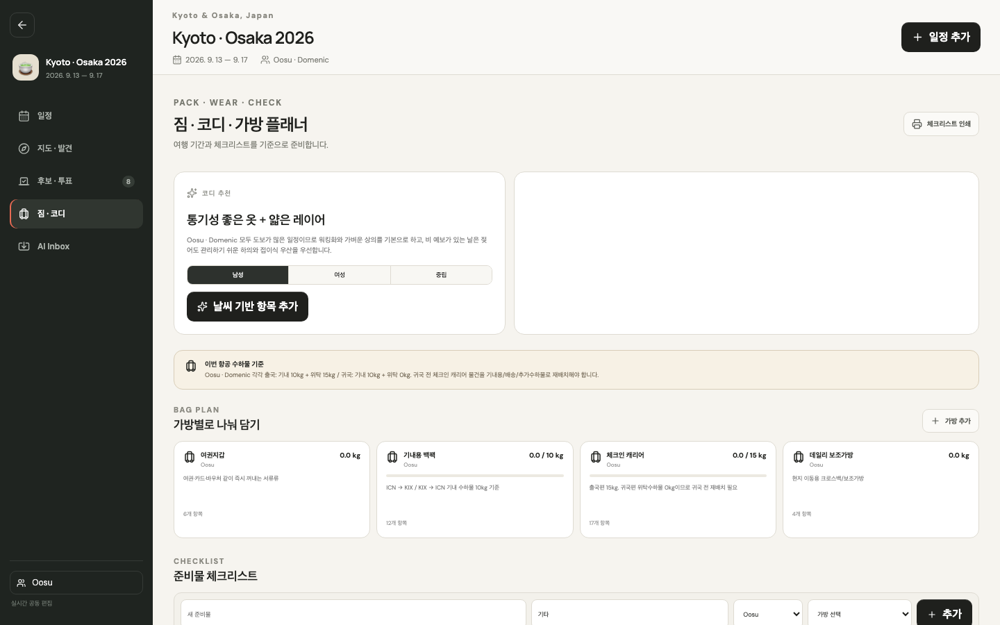

# MyTrip Planner

> Personal AI trip planner for itinerary, maps, weather, packing and voting — all in one place.<br>
> 일정, 지도, 날씨, 준비물, 투표까지 한곳에서 관리하는 개인 AI 여행 플래너입니다.

**Live:** [mytrip.oosu.dev](https://mytrip.oosu.dev)



## Overview

MyTrip is a self-hosted travel workspace designed to replace the usual mix of Sheets, Docs, chat, Notion, map bookmarks, and calendar screenshots. It keeps planning, confirmed bookings, candidate places, weather, packing, and group decisions in one shared trip project.

MyTrip은 여행 준비 과정에서 Sheets, Docs, 메신저, Notion, 지도 즐겨찾기, 캘린더 등에 흩어지는 정보를 하나의 여행 프로젝트로 모으기 위한 셀프호스팅 여행 워크스페이스입니다. 계획, 확정 예약, 장소 후보, 날씨, 준비물, 동행자 의사결정을 한곳에서 관리합니다.

The app is intentionally login-free for a small trusted travel group and stores trip state in SQLite on a self-hosted Mac mini. Sensitive booking codes, payment data, phone numbers, and confirmation tokens are not persisted in itinerary data.

소수의 신뢰할 수 있는 동행자가 사용하는 것을 전제로 로그인 기능 없이 구성했고, 여행 데이터는 Mac mini의 SQLite에 저장합니다. PNR·예약번호·결제정보·전화번호·예약 관리 토큰 같은 민감정보는 일정 데이터에 저장하지 않습니다.

## Screenshots

| Day plan · 일정 | AI Inbox · AI 여행 도우미 |
| --- | --- |
|  |  |

| Packing · 짐과 코디 | Home · 여행 프로젝트 |
| --- | --- |
|  |  |

## Core experience

- **Project home** — create a new trip or jump back into an existing project.<br>
  **프로젝트 홈** — 새 여행을 만들거나 기존 여행 프로젝트로 바로 들어갈 수 있습니다.

- **AI Inbox** — ask trip-aware LLM questions or paste airline, hotel, and train confirmations. AI recommendations can be saved directly into the shared shortlist.<br>
  **AI Inbox** — 현재 여행 일정과 날씨를 바탕으로 LLM에게 질문하거나 항공·호텔·기차 예약 내용을 붙여넣을 수 있습니다. AI 추천은 곧바로 공유 후보 목록에 저장할 수 있습니다.

- **Day plan** — drag events between dates, edit time inline, and see the forecast for every travel day.<br>
  **일정 플래너** — 일정을 날짜 사이에서 드래그하고 시간을 바로 수정하며, 각 여행 날짜별 날씨 예보를 함께 확인합니다.

- **Map-first discovery** — search and collect places on an interactive map. MapLibre + OpenStreetMap works without an API key, with Google Places support available server-side.<br>
  **지도 중심 장소 탐색** — 인터랙티브 지도에서 장소를 검색하고 저장합니다. 기본적으로 MapLibre + OpenStreetMap을 사용하며 서버에 Google Places를 연결할 수도 있습니다.

- **Candidates + voting** — Oosu and Domenic can save places, vote, and turn the selected option into a scheduled event.<br>
  **후보 · 투표** — Oosu와 Domenic이 장소 후보를 저장하고 투표한 뒤 선택된 장소를 실제 일정으로 전환할 수 있습니다.

- **Weather-aware packing** — manage bags, owners, item weights, baggage limits, daily outfit suggestions, and a print-friendly checklist.<br>
  **날씨 기반 짐 · 코디** — 가방별 물건, 담당자, 무게, 수하물 제한, 날짜별 코디 추천을 관리하고 준비물 체크리스트를 인쇄할 수 있습니다.

- **Realtime collaboration** — Socket.IO broadcasts trip updates to every open browser.<br>
  **실시간 공동 편집** — Socket.IO를 통해 같은 여행을 열어 둔 브라우저에 변경사항을 실시간 동기화합니다.

## Product flow

```text
Paste booking / search a place / ask AI
                  ↓
          Shared candidate pool
                  ↓
              Group vote
                  ↓
        Drag into the day plan
                  ↓
   Live map + weather + packing list
```

Booking text, map search, and AI recommendations all converge into a shared candidate and itinerary workflow.

예약문 붙여넣기, 지도 검색, AI 추천을 각각 따로 관리하지 않고 하나의 후보 목록과 일정 흐름으로 연결하는 것이 핵심입니다.

## Architecture

```text
React + Vite
  ├─ DnD Kit day planner
  ├─ MapLibre map
  └─ Socket.IO client
          │
          ▼
Express + Socket.IO :8290
  ├─ SQLite (better-sqlite3)
  ├─ Open-Meteo weather
  ├─ Nominatim / Google Places
  └─ OpenAI Responses API
          │
          ▼
Cloudflare Tunnel → mytrip.oosu.dev
```

The browser stays focused on interaction while booking parsing, AI calls, persistence, geocoding, weather, and realtime collaboration are handled server-side.

브라우저는 여행 계획 인터랙션에 집중하고, 예약 파싱·AI 호출·데이터 저장·지오코딩·날씨·실시간 동기화는 서버에서 처리합니다.

## AI behavior

With `OPENAI_API_KEY`, MyTrip uses the server-side OpenAI Responses API for booking extraction and trip-aware recommendations. The key is never exposed to the browser.

`OPENAI_API_KEY`가 설정되어 있으면 서버의 OpenAI Responses API를 사용해 예약 정보를 구조화하고 현재 여행 컨텍스트에 맞는 추천을 생성합니다. API 키는 브라우저에 노출하지 않습니다.

The app still has deterministic fallbacks for common booking parsing, map search through OpenStreetMap/Nominatim, and weather-aware packing suggestions.

AI 연결이 없더라도 일반적인 예약문 파싱, OpenStreetMap/Nominatim 장소 검색, 날씨 기반 준비물 추천은 기본 로직으로 동작합니다.

## Reference patterns

The implementation was informed by public travel-planner projects without copying their product identity.

공개 여행 플래너 프로젝트들의 구현 패턴을 참고하되 제품 정체성이나 UI를 그대로 복제하지 않고 MyTrip 흐름에 필요한 부분만 선별했습니다.

- `liketrek/TREK` — drag-and-drop day plans, booking import, packing, and self-hosting.<br>
  드래그 앤 드롭 일정, 예약 가져오기, 준비물 관리, 셀프호스팅 구조를 참고했습니다.
- `Jagatees/grab-hackthon-2026` — collaborative shortlist and voting flow.<br>
  그룹 후보 선정과 투표 흐름을 참고했습니다.
- `ladHarsh/AI-TripPlanner` — map and routing fallback approach.<br>
  지도와 라우팅 fallback 전략을 참고했습니다.
- `Biko-KHM/PLANEXA` — AI and Places provider composition.<br>
  AI와 장소 검색 provider 조합 방식을 참고했습니다.
- `mjunaidca/travel-ai-service` — server-side AI/map boundaries.<br>
  서버 중심 AI·지도 연동 경계를 참고했습니다.
- `nishant-sharma-99/PlanetPath-AI-Travel-Planner` — structured AI output into itinerary data.<br>
  AI 결과를 구조화된 일정 데이터로 넘기는 방식을 참고했습니다.
- TripSketch — map-first scheduling and low-friction planning.<br>
  지도 중심 일정 편집과 빠른 여행 계획 UX를 참고했습니다.

## Local development

```bash
npm install
npm run dev
```

- Web: `http://localhost:5173`
- API: `http://localhost:8290`

Run the full production check before deployment.

배포 전에는 타입체크와 프로덕션 빌드를 함께 실행합니다.

```bash
npm run check
npm start
```

## Environment

Copy `.env.example` to `.env` only on the deployment host.

`.env.example`을 참고하되 실제 `.env`는 배포 서버에서만 관리합니다.

```env
PORT=8290
DATA_DIR=./data
OPENAI_API_KEY=
OPENAI_MODEL=gpt-5-mini
OPENAI_BASE_URL=https://api.openai.com/v1
GOOGLE_MAPS_API_KEY=
```

`OPENAI_API_KEY` and `GOOGLE_MAPS_API_KEY` are server-only and must never be exposed through `VITE_*` variables.

`OPENAI_API_KEY`와 `GOOGLE_MAPS_API_KEY`는 서버 전용이며 `VITE_*` 변수로 브라우저에 노출하지 않습니다.

## Deployment

The production service runs on the Oosu Mac mini with Node 22, launchd, SQLite, and Cloudflare Tunnel.

운영 서비스는 Oosu Mac mini에서 Node 22, launchd, SQLite, Cloudflare Tunnel 조합으로 실행합니다.

```text
~/Services/mytrip-planner
  ├─ dist/
  ├─ dist-server/
  ├─ data/mytrip.sqlite
  ├─ .env
  └─ deploy/start.sh

Cloudflare Tunnel
  └─ mytrip.oosu.dev → http://127.0.0.1:8290
```

## Privacy boundary

- **Do not commit** PNRs, booking IDs, phone numbers, payment details, reservation deep-link tokens, or copied emails.<br>
  **커밋 금지** — PNR, 예약번호, 전화번호, 결제정보, 예약 관리 토큰, 복사한 이메일 원문은 저장소에 올리지 않습니다.
- Raw booking text is discarded after parsing; only redacted structured itinerary data remains.<br>
  예약 원문은 파싱 이후 폐기하고 일정에 필요한 구조화 데이터만 남깁니다.
- The project currently has no login system because it is intended for a small trusted group.<br>
  현재는 소수의 신뢰된 동행자를 위한 프로젝트이므로 별도 로그인 시스템을 두지 않습니다.

## Next upgrades

- iOS Calendar-style time resizing and richer event editing<br>
  iOS Calendar 스타일 시간 리사이즈와 상세 일정 편집
- Route-time optimization between scheduled places<br>
  일정 장소 사이 실제 이동시간 기반 동선 최적화
- Google Places photos and richer place details<br>
  Google Places 사진 및 상세 장소 정보
- Apple Calendar `.ics` export<br>
  Apple Calendar `.ics` 내보내기
- Optional project share code<br>
  전체 로그인 없이 사용할 수 있는 프로젝트 공유 코드
- Shared expense tracking<br>
  동행자 공동 경비 관리
